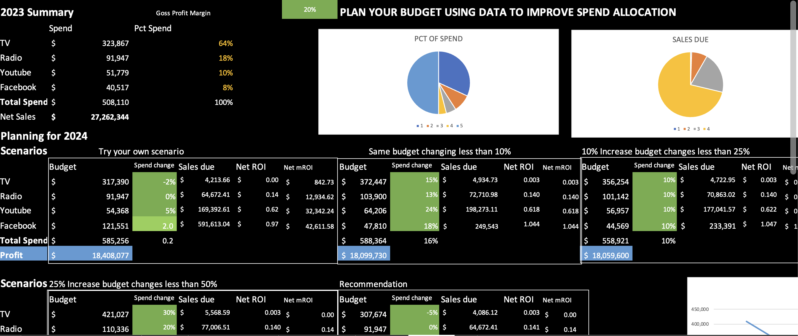

## Dashboard Preview

# State Spending ROI Analysis (Excel)

## Overview
This project analyzes state-level government spending and evaluates return on investment (ROI) across key public sectors.

The goal is to determine which spending categories generate the strongest economic or performance outcomes relative to cost.

## Objectives
- Compare state expenditures across categories
- Calculate ROI metrics
- Identify high-efficiency vs low-efficiency spending areas
- Provide data-driven recommendations

## Methods & Tools
- Microsoft Excel
- Pivot Tables
- ROI Calculations
- Conditional Formatting
- Interactive Dashboard

## Key Insights
- Certain spending categories produce significantly higher ROI.
- States with optimized allocation strategies outperform peers.
- Data suggests reallocation opportunities for improved efficiency.

## Files Included
- `State_Spending_ROI.xlsx` – Full interactive Excel model
